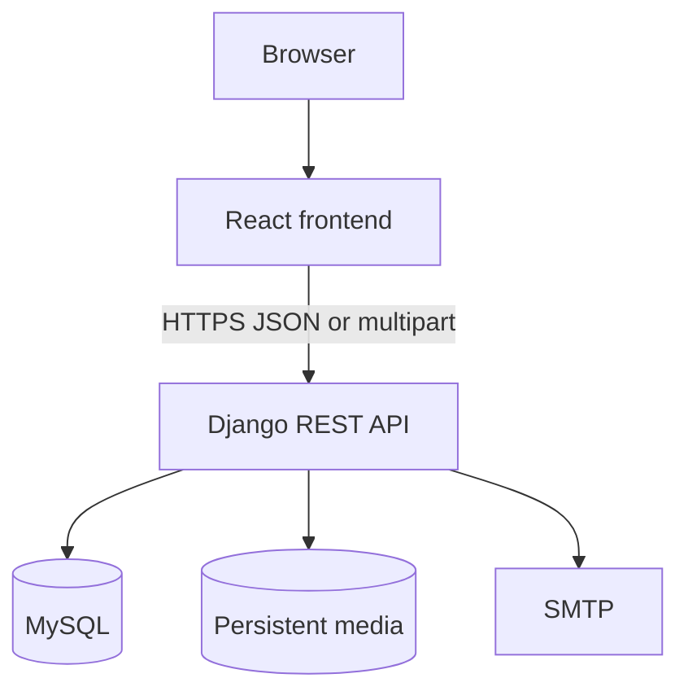
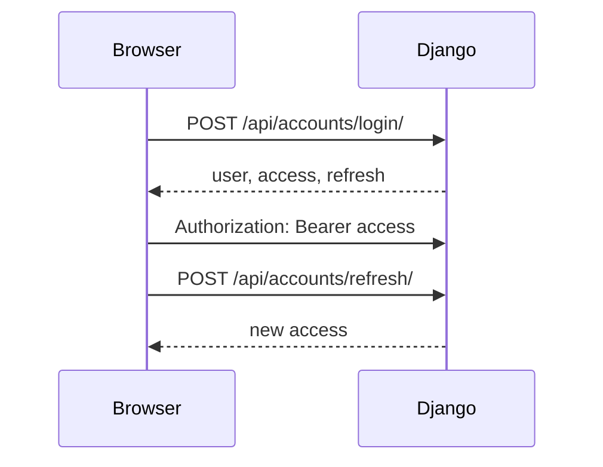
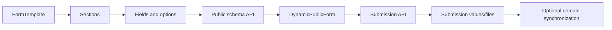
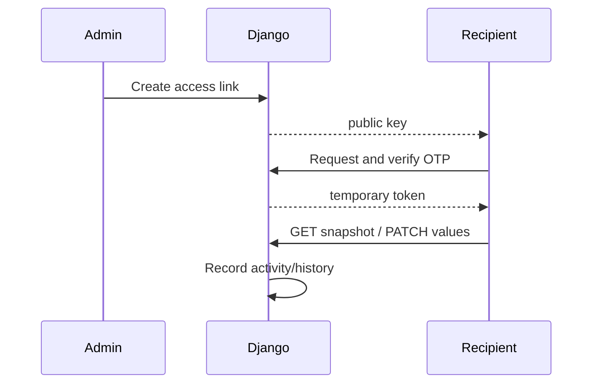

# Shahm Architecture

## Runtime Topology



React uses a configurable API base URL. Dashboard calls carry a Simple JWT access token. Django/DRF owns authorization, persistence, file validation, email dispatch, and dynamic schemas.

## Source Architecture

```text
config/              Canonical Django project configuration
  settings/          Shared, development, production, and isolated-test settings
apps/                Installed domain applications with stable app labels
  accounts/ ... team/
  core/              Migration-owning visits/system-seed app and public facade
common/              Cross-application middleware, errors, pagination, permissions
integrations/email/  Database-configured SMTP delivery
apps/services/        Service domain and its internal access/appointment packages
```

Domain applications are physically grouped under `apps/`. Their AppConfig names use `apps.<package>`, while explicit labels retain the historical values used by migrations and database identity. `config.settings` selects development when `DEBUG=True` and secure production settings otherwise.

## Authentication Flow



Roles are `super_admin`, `admin`, `editor`, and `viewer`. Initial administrator provisioning is environment-gated and disabled by default.

## Dynamic Form Flow



Schemas, keys, option sources, validation, and success responses are database driven. Multipart submissions store files separately and can synchronize service request, appointment, or career records.

## Service Request Flow

Public service data and dynamic forms create service advisory submissions. Dashboard endpoints review requests and administer temporary access links.

## Appointment Flow

CMS endpoints manage page content, settings, slots, and bookings. Public endpoints expose page/settings/slots. Form actions synchronize submissions into `AppointmentBooking`.

## Career Application Flow

Public career jobs come from the services router. Configured dynamic-form actions create application domain records; dashboard APIs manage jobs and read applications.

## Request Edit / Access Link / OTP Flow



Snapshots expose only publicly editable fields. Sessions, expiry, revocation, masking, and audit events are enforced under `apps/services/access/`.

## Email Template Flow

Stable template keys select `apps.messaging.models.EmailTemplate`. Context placeholders are rendered by `apps.messaging.utils`; `integrations.email.services` sends text/HTML using database-configured SMTP.

## Media Flow

Every `upload_to` path resolves beneath root `MEDIA_ROOT`. Development serves media only in debug mode. Production uses persistent storage/web-server delivery; runtime media is never committed.

## Project Attribution

Project source developed by **ENG. FAHAD ALSHWIHANI**. Portfolio: [fyaa.io](https://fyaa.io) · [GitHub](https://github.com/FahadAlshwihani) · [LinkedIn](https://www.linkedin.com/in/fahad-alshwihani/).

Copyright © 2026 ENG. FAHAD ALSHWIHANI.
